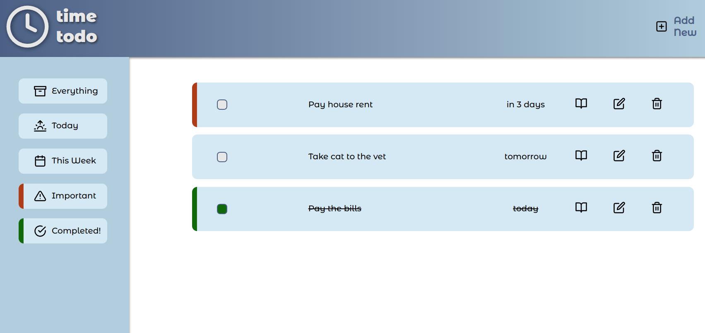

# Time Todo App

Welcome to Time Todo, a simple todo list application that helps you manage your tasks efficiently. This app is built with vanilla JavaScript, CSS, and HTML, following the Model-View-Controller (MVC) architecture. It also utilizes Webpack for module bundling.

## Table of Contents

- [Time Todo App](#time-todo-app)
  - [Table of Contents](#table-of-contents)
  - [Features](#features)
  - [Usage](#usage)
  - [Website](#website)
  - [License](#license)

## Features

- Add, edit, and delete tasks
- Set priority and due date for tasks
- Mark tasks as completed
- Filter tasks by priority and completion status
- Persist tasks in the browser's local storage

## Usage

1. Enter your task in the input field and press Enter or click the "Add New" button to add it to the list.
2. Edit a task by clicking the edit button (pencil icon) next to it.
3. Delete a task by clicking the delete button (trash icon) next to it.
4. Mark a task as completed by clicking the checkbox.
5. Check for more details of task by clicking book icon
6. Use the date, priority and completion filters to filter the tasks based on their status.
7. Tasks are automatically saved and retrieved from the browser's local storage.

## Website

You can access the Time Todo app online by visiting the following link: [Time Todo App](https://bulutyerli.github.io/todoapp/).

## License

This project is licensed under the [MIT License](LICENSE).
